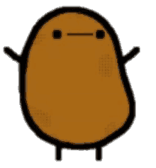

<h1 align="center">Hi 👋, I'm Felipe Colli</h1>
<h3 align="center">A chilean rando who likes Linux, Gundam and C++</h3>

- 🔭 I’m a Ex-Institutano **(Gen 2025, last all male Gen)**
- 🌱 I’m currently learning **Competive Programming**
- 😎 I maintain my [DotFiles](https://github.com/F-Patata2008/DotFiles-New.git)
- 👽 Im also a member of [Fisex](https://github.com/Academia-de-Fisica-Experimental-IN)
- ⚡ Fun fact **I use Arch BTW, Hyprland, Neovim, and I like Mecha**
- 😊 Follow Fisex on [Instagram](https://instagram.com/fisicaexp.in)
- 🤯 Im Bored with classes
- 😝 My playlist for coding [Alt](https://open.spotify.com/playlist/217GRfBpH3XssarZblg6OQ)

 

<h3 align="left">Connect with me:</h3>

  <!-- Instagram -->
  
  <!-- Codeforces -->
  

<h3 align="left">Languages and Tools:</h3>

  <!-- Arduino -->
  

  <!-- C++ -->
  

  <!-- Git -->
  

  <!-- Arch Linux -->
  

  <!-- Hyprland (Fixed Link) -->
  

  <!-- Python -->
  

  <!-- Neovim -->
  

<h2 align="center">Stats of GitHub</h2>

  
  

  

